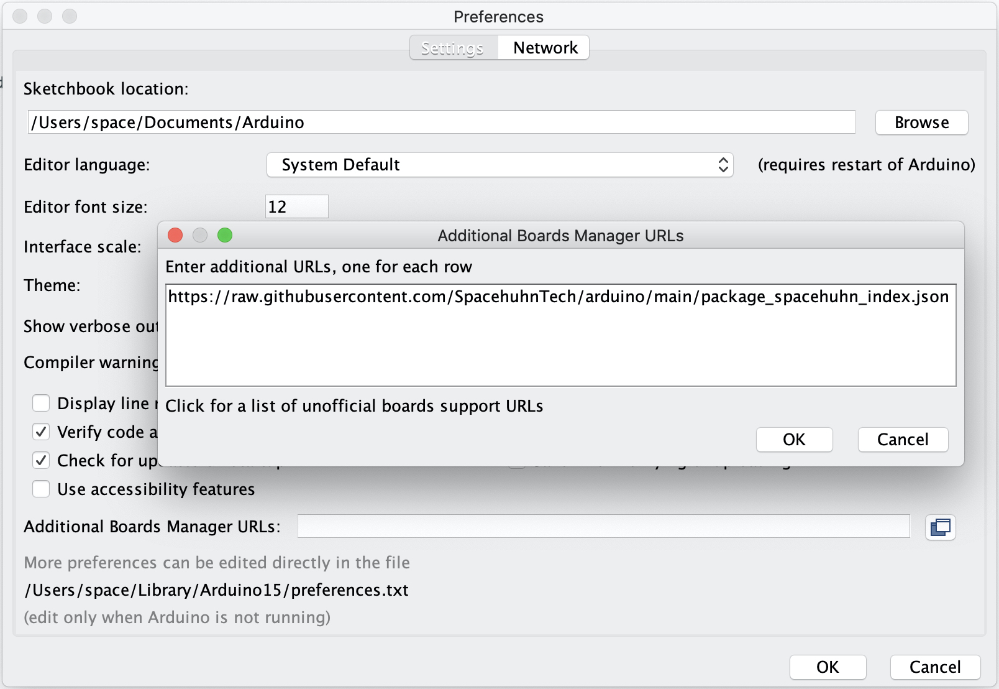

# Arduino Board Definitions

Modified Arduino board definitions for projects by [Spacehuhn Technologies](https://github.com/spacehuhntech/).  
This repository is meant to be a central place to automatically publish these project related arduino boards, so you can have an easier time installing and using them.  
See the links below to learn more about the available platforms and their modifications.  

## Projects & Platforms

* [ESP8266 Deauther](https://github.com/spacehuhntech/esp8266_deauther)
  * [ESP8266](https://github.com/spacehuhntech/arduino-esp8266/tree/deauther)
* [WiFi Duck](https://github.com/spacehuhntech/wifiduck)
  * [ESP8266](https://github.com/spacehuhntech/arduino-esp8266/tree/wifiduck)
  * [AVR](https://github.com/spacehuhntech/arduino-avr/tree/wifiduck)
  * [SAMD](https://github.com/spacehuhntech/arduino-samd/tree/wifiduck)

## Installation

* Install and [Arduino IDE](https://www.arduino.cc/en/Main/Software)  

* Go to **File** -> **Preferences** -> **Additional Boards Manager URLs** and add:  
   `https://raw.githubusercontent.com/SpacehuhnTech/arduino/main/package_spacehuhn_index.json`  
   
* Now you can to `Tools` -> `Board` -> `Boards Manager` and install a package, for example `deauther`

